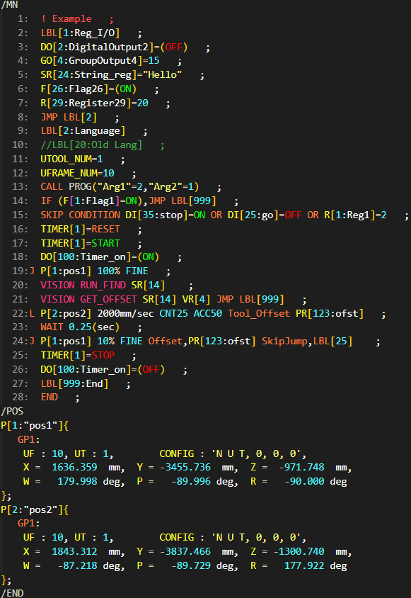
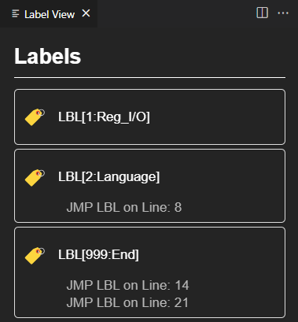
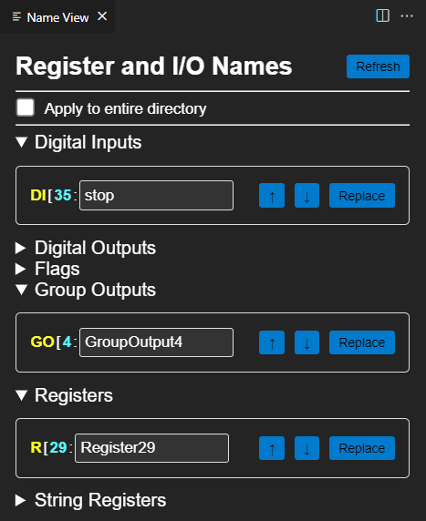

# CodeFanuc TP Assist README

This extension is to assist in software development that includes Fanuc proprietary Teach Pendant Programming. It contains a defined syntax and custom theme, as well as multiple coding efficiency, autofill features, commands, and interactive webviews.

## Features

- **Automatic Line Renumbering**: Automatically renumbers in-text lines in .ls files when changes are made.
- **Automatic Semicolon Placement**: Automatically ends in-text lines in .ls files with a semicolon.
- **Label Webview Command**: View all the Labels and Jump Labels in your code and move to the line number.
- **Register & I/O Webview Command**: View all of the LS file data types and I/O in your active file. Adds button to replace name in the active file, or all in directory. Jump to line in code of each item with arrow buttons.
- **Update Line Numbers Command**: Manually update in-text lines in .ls files on command.    
- **CodeFanuc Theme**: Custom theme for LS, KL, DT, and CF filetypes.

  <h1><strong>CodeFanuc Theme Screenshot</strong></h1>
  

  <h1><strong>Label Webview Screenshot</strong></h1>
  

  <h1><strong>Register & I/O Webview Screenshot</strong></h1>
  

## Requirements

VS Code 1.95.0

## Usage

- **CodeFanuc Theme**: Set using the Color Theme option in VS Code.
- **Automatic Line Renumbering**: This feature is enabled by default.
    CAN BE DISABLED with user setting "autoLineRenumber": false
- **Update Line Numbers Command**: Use the command `Update Line Numbers`. Ctrl+Shift+P
- **Automatic Semicolon Placement**: Attached to Line Renumbering.
- **Label Webview Command**: Use the command `Open Label View` to open this webview. Ctrl+Shift+P
- **Register & I/O Names Webview Command**: Use the command `Open Name View` to open this webview. Ctrl+Shift+P
- **Ctrl+Click to Open Filename**: Ctrl+click on a program name in `CALL/RUN 'programName'` to open the corresponding file if it exists in the same directory.

## Installation

1. Install the extension from the VS Code Marketplace.

## Contributing

Contributions are welcome! Please open an issue or submit a pull request on GitHub.

## License

[MIT](https://github.com/NateyJayBee/fanuctpp/blob/master/LICENSE.md)

## Known Issues

To see current issues and to report issues, please visit our [GitHub Issues Page](https://github.com/NateyJayBee/fanuctpp/issues).

## Release Notes

CodeFanuc release 1.1.2
- Added Update Line Number command
- Refactored repository for reasons

CodeFanuc release 1.1.1
- Changed end of line semicolon spacing to one

CodeFanuc release 1.1.0
- Added arrow buttons in name webview for navigation
- Changed cursor movement on line deletion
- Added more Karel syntax
- Fixed line-continuations not having semicolon

CodeFanuc release 1.0.0
- Repurposed existing syntax for (.DT) and (.CF) files
- Created name webview and command to open it
- Minor syntax additions to (.LS) files
- New icon and name

CodeFanuc release 0.0.2
- Created themed syntax for (.KL) files
- Minor bugfixes

CodeFanuc release 0.0.1
- Created label webview and command to open it
- Created ctrl+click definition to open filename if it's in the same directory as current file

CodeFanuc pre-release 0.0.1
- Created extension with themed syntax for (.LS) files
- Created first version of event handling for document changes

**Enjoy!**
